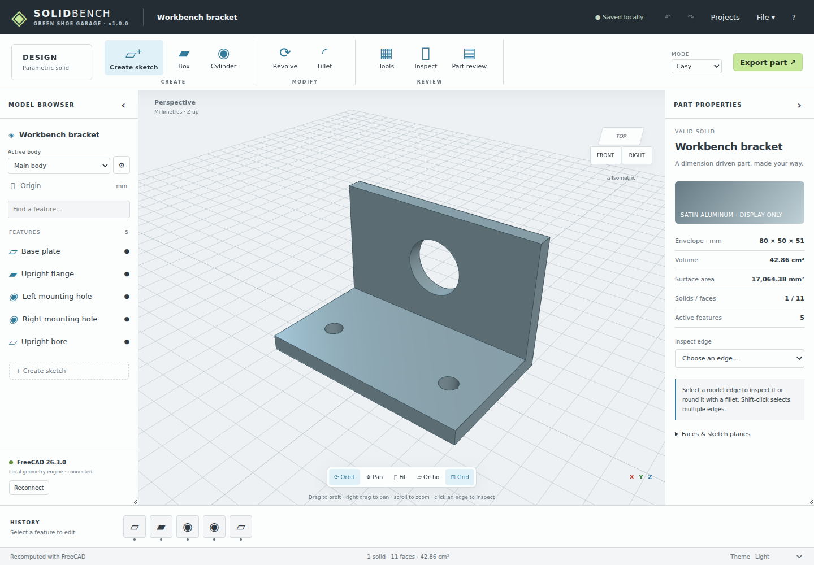

# SOLIDBENCH v1.0.0

**SKETCH → SOLID → REFINE → DRAW → EXPORT**

A self-hosted browser CAD workbench for Green Shoe Garage. A Fusion-inspired toolbar, model browser, inspector and feature timeline sit over **real FreeCAD geometry running on your own computer or server**. No Docker, frontend build, cloud account or AI service is required.

SOLIDBENCH is an independent application powered by FreeCAD, not the complete FreeCAD desktop application running inside a browser, and not a feature-for-feature replacement for Autodesk Fusion. See [CAPABILITIES.md](docs/CAPABILITIES.md) for the exact v1.0 scope.



## Start without Docker

The verified installation target is **Linux x86-64 with a current Chromium browser**. macOS/Windows launch scripts are included, but native runtimes on those platforms have not been verified. Windows users can run the Linux service in WSL2 without Docker. Package availability and Python ABI compatibility matter; use the doctor before modeling.

1. Install [micromamba](https://mamba.readthedocs.io/en/latest/installation/micromamba-installation.html) using its official instructions. Ensure `micromamba` is on your terminal PATH.
2. Extract this ZIP and open a terminal in the extracted directory, beside `server.py`.
3. Install the geometry environment once:

```sh
micromamba create -y -n solidbench -c conda-forge python=3.11 freecad=2026.09.16
```

4. Diagnose, then launch:

```sh
micromamba run -n solidbench python launch.py --doctor
micromamba run -n solidbench python launch.py
```

The launcher checks FreeCAD, starts the service and opens **http://localhost:8080**. Keep its terminal running. Ctrl+C stops the service. If the browser does not open, visit that address yourself.

After setup, convenience launchers are `./start.sh` on Linux, `start.command` on macOS and `start.bat` on Windows. If ZIP extraction removed executable permissions, use `bash start.sh`. Finder may not inherit your shell PATH: use the explicit `micromamba run` command from Terminal when needed. Use `--port 8081` for an occupied port, or `--no-browser` on a headless machine.

The pinned conda-forge snapshot reports **FreeCAD 26.3.0**. It is the package tested here, not a claim about FreeCAD's current stable release. The first installation downloads a substantial environment; allow several GB of disk space. Internet access is unnecessary after dependencies are installed. `environment.yml` is a package specification, not a complete transitive dependency lock.

### Use an existing compatible FreeCAD runtime

The service itself uses Python's standard library. Native geometry needs a Python interpreter compatible with the FreeCAD modules:

```sh
FREECAD_PYTHON=/absolute/path/to/compatible/python \
FREECAD_LIB=/absolute/path/to/freecad/lib \
python3 launch.py --doctor
```

Use the same variables without `--doctor` to launch. `FREECAD_LIB` is optional when the modules are already discoverable. The adapter checks the interpreter's `lib` directory and `/usr/lib/freecad/lib`. Installing a desktop application alone does not make its native modules compatible with an arbitrary system Python. A failed doctor explains the import/startup error.

**Do not double-click `public/index.html` to run CAD.** The browser files are static and need no compilation, but geometry is supplied by the Python/FreeCAD host.

## First useful part

The initial bracket demonstrates an extruded plate, flange, mounting holes and upright bore. Open **File → New project** for an empty design, or **Projects** for templates and named revisions.

1. **Create sketch**. Draw a rectangle, circle or polygon, or enter coordinates. Choose its plane and extrusion depth, then **Create solid**.
2. Add another feature using **Join**, **Cut** or **Intersect**. The first active feature in each body must add material.
3. Select an edge in the viewport or Inspect's edge list, then **Fillet** or **Chamfer**. Shift-click selects multiple edges.
4. Double-click a feature in the browser or timeline to edit it. Later features rebuild. Failed operations preserve the editable history and offer an error; edit or Undo to recover.
5. Export STEP for exact interchange, STL for slicing, FCStd for desktop FreeCAD, or JSON to keep the fully editable SOLIDBENCH project.

The project browser also includes a **Parametric spacer** template. Change `diameter`, `bore` or `thickness` using **Tools → Parameters** to see a full recompute.

## Sketches and precise modeling

**Constraints** opens an entity editor for lines, arcs, circles and construction geometry. Use exact entity coordinates and FreeCAD constraints: horizontal, vertical, coincidence, parallel, perpendicular, equal, tangent, line length, radius, diameter and coordinate distances. Entities are numbered from 1. Line endpoints use point 1 or 2; circle centers use point 3. Only fields applicable to the selected constraint are interpreted. Solve reports under-constrained/fully constrained status and conflicts. A solid needs a closed profile.

Advanced mode reveals parameter expression fields and specialist ribbon controls. **Tools** remains available in both modes; on a phone use **File → Modeling tools**. Enter feature expressions as `depth = thickness * 2`. Named parameters can reference earlier parameters using numbers, `pi`, `+`, `-`, `*`, `/` and parentheses. No arbitrary code is executed. References to later or unknown parameters fail explicitly.

**Tools** supplies loft, circular-profile sweep, shell, draft, mirror, linear/circular body pattern, transform and body boolean. Numeric controls and text rows provide precise, keyboard-accessible input. See the capability matrix for each operation's limits. The `examples/` folder also includes a two-body instrument enclosure with a shell and movable cover.

All dimensions are **millimetres**; angles are degrees. STL carries coordinate values in mm but no unit metadata.

| Sketch plane | Local X | Local Y | Positive extrusion normal |
|---|---|---|---|
| XY | world X | world Y | +Z |
| XZ | world X | world Z | −Y |
| YZ | world −Z | world Y | +X |

Plane offset is along its positive normal. **Inspect → Faces & sketch planes** starts a sketch on a planar face. Custom datums use an explicit origin and normal. Face and edge references may need reselection after upstream topology changes. References are checked; an ambiguous edge reference fails instead of selecting an arbitrary edge. In an existing dress-up feature, explicitly choose **Rebind to entered edge numbers** to replace old references after inspection.

## Bodies and assembly positioning

Each body has independent geometry history and appearance. Choose the active body above the model tree. **Tools → Bodies & joints** creates, copies, hides, colors, positions and deletes bodies; deletion is undoable. The global feature timeline defines evaluation order, including body boolean dependencies. A body boolean uses the source geometry available at that point in history, before assembly placement.

Each component has position, a rotation about Z, and an optional grounded revolute or slider coordinate with limits, axis and pivot. This is basic kinematic positioning, not a full mate-network solver or physics engine. **Interference** computes exact volumetric overlap between components, including hidden ones; touching faces are not interference. Overlapping assembly volumes are summed in aggregate statistics, not unioned.

STEP files open as independent bodies with embedded source data. Their original parametric history and assembly metadata are not reconstructed. Exports can target one body or all visible bodies; FCStd always contains the complete document.

## Drawings and reports

**Tools → Drawing sheet** generates native top, front and right projections. It provides envelope dimensions, circular-edge diameters, optional Z cut, a note and component list. Expand **Add dimensions** to select two projected vertices/circle centers, choose horizontal, vertical or aligned measurement, and add offset and symmetric tolerance. Click amber points or use the point selectors.

Reference dimensions use checked projected coordinates. If points move, disappear or belong to a different section, the sheet flags them and blocks export until removed/recreated. Envelope and diameter dimensions update automatically. Views are independently fitted, not a common calibrated sheet scale. GD&T, datum systems, hidden-line configuration and complex annotation layout remain downstream drawing tasks. Review dimension placement before fabrication.

Use **Print / PDF** for the sheet and parts list, or **Export SVG sheet** for vector views and dimensions. The SVG contains the note and views; the printable sheet also includes the component table. **Part review** on the ribbon produces a separate illustrated geometry/history report.

## Save, revisions and recovery

- Editable source autosaves to **IndexedDB in this browser**, with a visible saving/saved/error indicator. One previous autosave is retained. Undo/redo keeps up to 60 changes during the current page session.
- **Projects → This browser** stores named local projects and immutable saved revisions. **My CAD host** stores revisions in SQLite on your host. Saves are explicit; browser autosave is not automatic host synchronization.
- Server saves check the expected revision. A conflicting newer save is never overwritten: open it or save as a separate project.
- **File → Save project JSON** creates a durable editable backup. JSON includes history, constraints, parameters, body placements, imported STEP data, notes and drawing dimensions. Schema 1 projects migrate to schema 2. Unsupported newer schemas are rejected without replacing work.
- **File → Previous saved state** restores the previous browser autosave. Restoring a named revision retains later revisions. Opening another project or loading a template is undoable.
- Clearing browser data/private browsing can erase local projects. Export JSON copies. Storage failures are visible; do not assume a saved revision exists until the save completes.
- Back up the host's `data/` directory while its service is stopped. See [HOSTING.md](docs/HOSTING.md) for restore and password handling.

## Offline operation and privacy

No telemetry, remote fonts, CDNs or hosted CAD accounts. Three.js is bundled. Source goes only to the host serving SOLIDBENCH for computation. Geometry jobs use temporary directories and clean them after completion. Host revisions remain until you remove or restore the host data directory.

With a local host running, modeling works without internet access. With a remote host disconnected, the cached interface and source remain accessible after a previous successful visit over HTTPS or localhost. A matching cached model is labeled **Cached view only**. New solids and native exports require the FreeCAD host. Cache failures may prevent offline geometry display; they do not replace the IndexedDB source backup.

This is a **single-owner workbench**, optionally protected by one host password. It is not a multi-tenant service. Native CAD workers execute as the service user, so use a dedicated unprivileged account for hosting. See the hosting guide before enabling remote access.

## Navigation and accessibility

Left drag orbits freely; right drag or Shift+drag pans; wheel/pinch zooms. Explicit Orbit/Pan, Fit, standard views and perspective/orthographic controls are available. The visual Z section changes only display; drawing sections and geometry exports have separate behavior.

Keyboard: **F** fit; **1/2/3/0** top/front/right/isometric; **Ctrl/⌘ Z** undo; **Ctrl/⌘ Shift Z** redo; **Ctrl/⌘ S** JSON export; **Delete** selected feature; **Escape** close dialogs. Numeric forms and the edge/point lists provide alternatives to pointer selection. Themes: light, dark and high contrast. Panels collapse and desktop widths persist. Mobile prioritizes viewing and numeric edits; dense constrained sketch editing is easier on a larger screen.

## Verification, maintenance and delivery

[TEST-REPORT.md](TEST-REPORT.md) records native and browser tests and unverified platforms. [ROADMAP.md](ROADMAP.md) records completed batches and remaining scope. Application version and service API version are 1.0.0; saved projects use schema 2. Future schema changes require migration or explicit rejection, never silent interpretation.

No package manager or build step is needed for the frontend. Runtime source is Python and browser ES modules. `tests/test_*.py` use unittest and the compatible FreeCAD Python. Browser suites use Playwright as a development-only dependency. `tools/package.py` creates a clean source ZIP with checksums, excluding user data and secrets. Docker is optional and documented separately; the release was tested directly on Linux.

GPL-3.0-only. Copyright 2026 Green Shoe Garage / Michael Parks. See `LICENSE` and [THIRD-PARTY-NOTICES.md](THIRD-PARTY-NOTICES.md). Autodesk and FreeCAD retain their names and marks; this project is independent and uses original interface code and branding.
